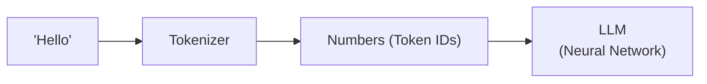
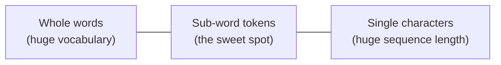
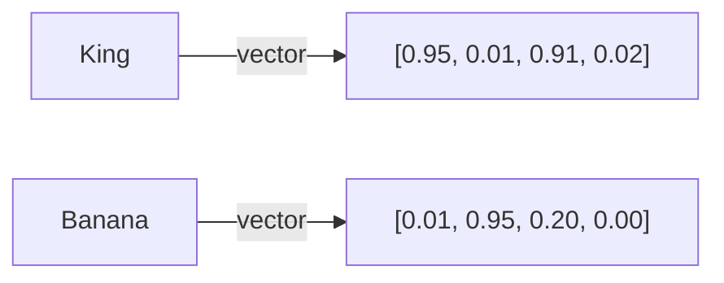
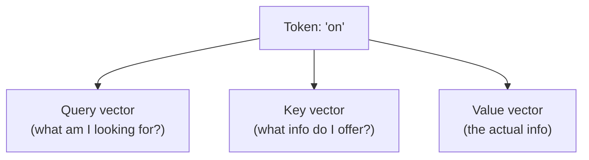
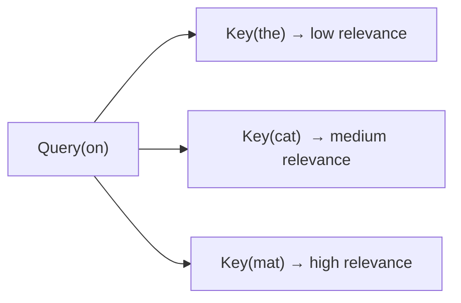
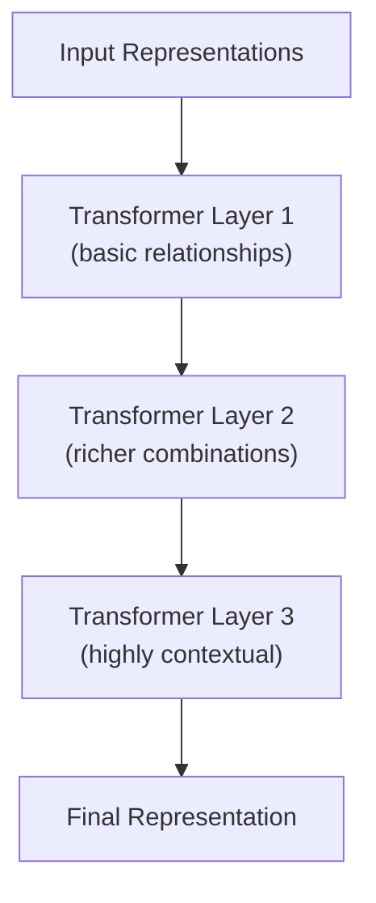
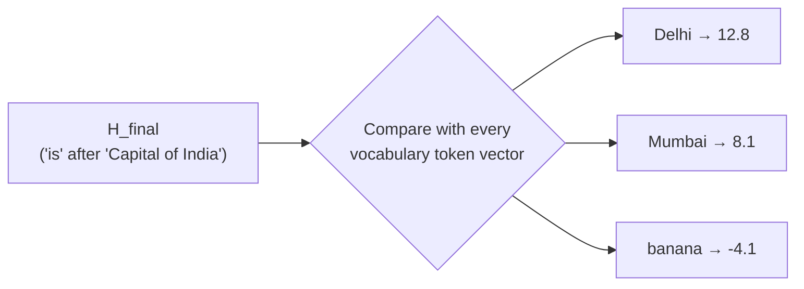
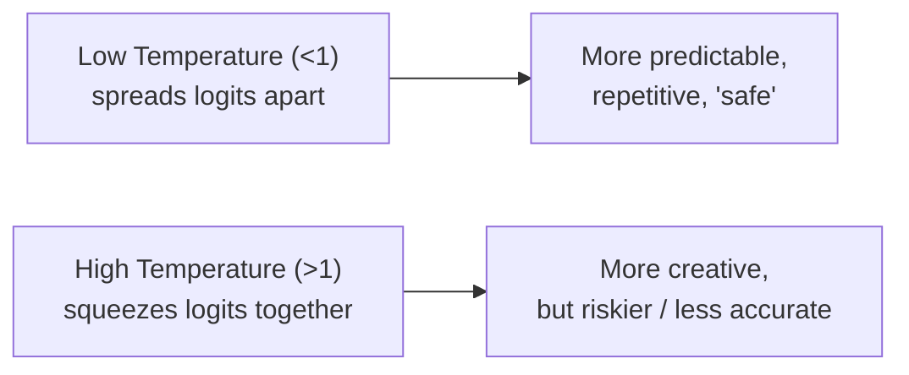
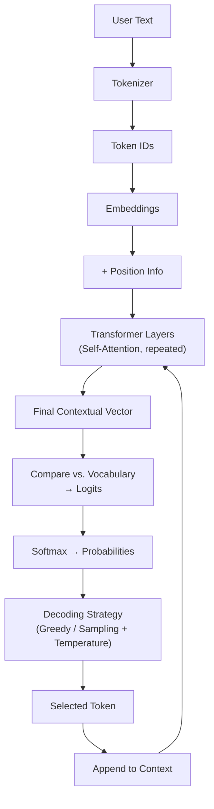

# Day 2 — How Large Language Models Work (Tokens to Transformers)

> **Series:** Forward Deployed Engineer (FDE) with Coder Army
> **Instructor:** Aditya Tandon

The internals of an LLM, explained bottom-up — tokenization → embeddings → attention → transformers → next-token prediction.

---

## 1. The Core Idea: Next-Token Prediction

At its core, an LLM does one simple thing:

> **Given everything written so far, predict what should come next.**

```
"I drink coffee every ___"          → morning / evening / day (many options)
"I drink coffee every morning
 before going to ___"                → work / gym / college (fewer options)
"I work remotely as a software
 engineer. Every morning I drink
 coffee before going to my ___"      → desk (very likely — much more context)
```

**More context → fewer, more confident possibilities.** The next piece of text depends on the *entire* available context, not just the previous word.

> Technically, it doesn't predict the next **word** — it predicts the next **token** (explained in §3).

---

## 2. Text Must Become Numbers

Neural networks only do math — addition, multiplication, weighted sums. They can't "read" text directly.



**Important:** Token IDs are arbitrary labels, not meaningful quantities.
```
cat → 1, car → 4    ➜  does NOT mean "car is 4x a cat"
Rohit → 104, Aditya → 237  ➜  does NOT mean Aditya is "more" than Rohit
```
They're just IDs — like roll numbers.

---

## 3. What Is a Token, Really?

**Common myths — both wrong:**
- ❌ "One word = one token"
- ❌ "One token = ~4 characters" (just a rough estimate, not a rule)

**Why not use whole words?** Vocabulary would explode — *automatic, automated, automation, automating*... each needs its own ID. Way too many unique tokens.

**Why not use single characters?** Vocabulary stays tiny (~26 letters), but sequences become *very* long — every sentence needs way more tokens to process.

**The real approach:** a tokenizer finds reusable **sub-word chunks** — something in between.

```
"Cofounder of Coder Army" → [Co][founder][ of][ Coder][ Army]   (GPT-3: 6 tokens)
"automatically"            → [aut][omat][ically]  or  [automatically]  (1 token in newer models)
```



Key facts:
- The **same character sequence always gets the same Token ID**, in any sentence.
- **Every model has its own tokenizer** — GPT-3, GPT-4, GPT-5, Claude, etc. all split text differently.
- **More advanced models have richer vocabularies** — they need *fewer* tokens for the same text (e.g. GPT-3 splits "automatically" into 2 tokens; GPT-5 often needs just 1). This is also true for emojis — newer models tokenize a 🔥 as a single token.
- **Token order matters** — `Dog bites man` and `Man bites dog` use identical tokens, just reordered, with opposite meaning. The model needs both the tokens *and* their positions.

---

## 4. Same Token, Different Meaning: Why Context Matters

```
"I deposited money at the bank."      → bank = financial institution
"I sat on the bank of a river."       → bank = riverside
```

Both sentences tokenize `bank` to the *exact same* Token ID. But the **meaning** is completely different — determined only by surrounding words. This is exactly the problem **embeddings + attention** solve.

---

## 5. Embeddings — Giving Tokens Meaning

A token ID only identifies *which* token it is — it carries no meaning. So each token is mapped to a **vector** (a list of numbers) across many learned "dimensions."

**Toy example (real models don't use human-labeled dimensions — this is just for intuition):**

| Word | Royalty | Food | Living | Technology |
|---|---|---|---|---|
| King | 0.95 | 0.01 | 0.91 | 0.02 |
| Banana | 0.01 | 0.95 | 0.20 | 0.00 |
| Laptop | 0.01 | 0.00 | 0.00 | 0.97 |



Real models use **thousands of dimensions** the model discovers *by itself* during training on massive text data — humans never label them, and nobody fully knows what each dimension "means." This is called **vector embedding**.

---

## 6. Attention: Query, Key, Value (Q, K, V)

Once tokens have embeddings, the model still needs to figure out **how tokens relate to each other in this specific sentence.**

**Analogy — a Google search:**
```
Your search text  →  Query   ("what am I looking for?")
Indexed pages     →  Keys    ("what info do I contain?")
Page content      →  Value   ("here's the actual info")
```

**Every token generates 3 vectors:** Query, Key, and Value.



**Why 3 separate vectors and not just 1?** Because the same token can be relevant to different things in different ways — just like a person can be described differently depending on what you're asking (their tech skills vs. their location vs. their morals).

### How self-attention actually works

Sentence: `The cat sat on the mat.` — processing the word **"on"**:



1. Compare `Query(on)` against the `Key` of every other token → get a **relevance score** for each.
2. Turn those scores into **weights** (via softmax).
3. Combine all the `Value` vectors using those weights → produces a new, **context-aware vector** for "on".

```
Z(on) = w1·Value(the) + w2·Value(cat) + w3·Value(sat) + w4·Value(mat) + ...
```

This is called **self-attention** — tokens in a sequence "attend to" other tokens in the *same* sequence to build richer meaning.

> **Attention is dynamic** — it's re-computed for every new sentence. The model never "permanently" learns that "it" = "animal"; the connection depends entirely on the current context. (Classic example: *"The animal didn't cross the street because it was too tired"* → "it" = animal. Change "tired" to "wide" → "it" = street.)

---

## 7. Transformers = Stacked Attention Layers

**Common misconception:** Transformer = Attention. Wrong — **attention is just one component inside a transformer layer.**



Each layer redoes the Q/K/V + self-attention process, building progressively richer, more contextual vectors. **Why multiple layers?** One layer can't capture every relationship in a complex sentence — like photo editing (exposure → contrast → color → detail), each layer refines the representation a bit further. Real models (like ChatGPT) use *many* such layers stacked together.

By the final layer, the last token's vector holds the **full context of the entire sentence**.

---

## 8. From Final Vector to Next Token

Once the last token's final vector (`H_final`) has the whole sentence's context, the model compares it against **every token in its vocabulary** (e.g. 100,000 tokens) to see which one fits best next.



These raw comparison scores are called **logits**. They're not probabilities yet.

### Softmax: Logits → Probabilities

**Softmax** converts logits into a clean probability distribution that sums to 100%:

```
Delhi   → 92%
Kolkata → 2%
Mumbai  → 1%
...
```

> Nobody — not even the model's creators — can fully explain *why* it assigns a specific score to a specific token. These weights were self-learned from massive training data; it's a black box in terms of exact reasoning.

---

## 9. Choosing the Actual Next Token

If the model always picked the highest-probability token, it would give the **exact same answer every time** for the same input. But we know ChatGPT gives different phrasing each time you ask "Hi, how are you?" — so something else is going on.

### Greedy Decoding
Always pick the highest-probability token. Deterministic, but repetitive and predictable.

### Sampling
Treat probabilities like a **lottery**. Higher probability = more tickets = more likely, but *not guaranteed*.

```
Java → 40 tickets   Python → 35 tickets   C++ → 15 tickets   Rust → 10 tickets
→ pick a random number 1–100 → whichever range it lands in, wins
```

This is why the *same input* can produce *different outputs* on different runs.

### Temperature — controlling creativity

Applied to logits **before** softmax: `adjusted logit = logit ÷ temperature`



| Temperature | Effect |
|---|---|
| **Low (e.g. 0.5)** | Widens the gap between top and lower candidates → model becomes more deterministic/repetitive |
| **1.0** | Baseline — no change |
| **High (e.g. 2.0)** | Flattens the distribution → lower-ranked tokens get a real chance → more creative, but more mistakes possible |

> Even at temperature = 1, **sampling** alone still means the model won't always pick the same word — that's why repeated identical prompts can yield different-sounding replies.

---

## 10. The Complete Pipeline



This loop — predict, append, repeat — is called **autoregressive generation**: the model uses its own previous output as input for the next prediction. This is also why LLMs generate text token-by-token (and why streaming responses are possible — each token is ready to display the moment it's generated).

---

## Key Takeaways

1. **LLMs predict the next token**, not the next word — based on the *entire* available context, not just the last word.
2. **Text becomes numbers via tokenization** — sub-word chunks, not whole words or single characters, balancing vocabulary size against sequence length.
3. **Token IDs are meaningless labels** — the actual meaning comes from **embeddings** (vectors across many learned dimensions).
4. **Attention (via Query, Key, Value)** lets each token dynamically figure out which other tokens matter to it, in the current sentence.
5. **Transformers stack multiple attention layers** to build progressively richer contextual understanding — attention is a component, not the whole transformer.
6. **Logits → Softmax → Probabilities** is how the model scores every possible next token.
7. **Decoding strategy (greedy/sampling) + temperature** determine which token is actually picked — this is why the same prompt can give different answers.
8. **Generation is autoregressive** — one token at a time, each new token built on all previous ones.

---

## FDE Interview Questions

1. **Q:** Does an LLM predict the next word or the next token? Why does this distinction matter?
   **A:** The next token — a token can be a whole word, part of a word, punctuation, or even a symbol. This matters because vocabulary size, cost (billed per token), and context window limits are all measured in tokens, not words.

2. **Q:** Why don't tokenizers just assign one token per whole word?
   **A:** Because natural language vocabularies are enormous and constantly growing (new terms, names, variations) — giving every unique word its own token would create an unmanageably large vocabulary. Sub-word tokenization reuses common fragments (like "auto" in automatic/automate/automation) to keep the vocabulary efficient.

3. **Q:** Two sentences use the exact same word with the same Token ID, but the word means something different in each. How does the model handle this?
   **A:** Through attention — the model builds a context-specific representation of the token by comparing its Query vector against the Key vectors of surrounding tokens, then blending in their Value vectors. The token ID stays the same, but the model's internal representation of it changes based on context.

4. **Q:** What's the difference between a logit and a probability in an LLM's output?
   **A:** A logit is a raw, unbounded numerical score representing how suitable a candidate token is — it hasn't been normalized. Softmax converts the full set of logits into a probability distribution that sums to 100%, which is what's actually used to select the next token.

5. **Q:** Why can the same prompt produce different responses from an LLM on separate occasions?
   **A:** Because of the decoding strategy — if the model uses sampling (rather than greedy decoding), it treats the probability distribution like a weighted lottery rather than always picking the top candidate. Temperature settings also affect how sharp or flat that distribution is, further influencing variability.

6. **Q:** As an FDE, why would you increase or decrease the temperature parameter when calling an LLM API?
   **A:** Lower temperature for tasks needing consistency and precision (e.g. structured data extraction, factual Q&A); higher temperature for tasks wanting creative or varied output (e.g. brainstorming, creative writing) — with the tradeoff that higher temperature increases the risk of incoherent or off-topic output.

---

*Part of a personal FDE interview-prep repository, based on the Coder Army "Forward Deployed Engineer" series by Aditya Tandon.*