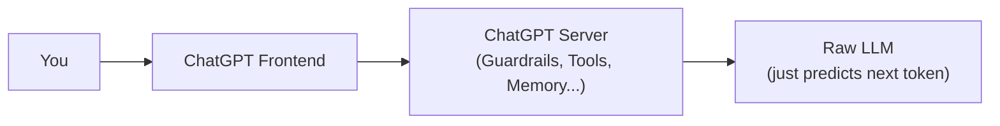
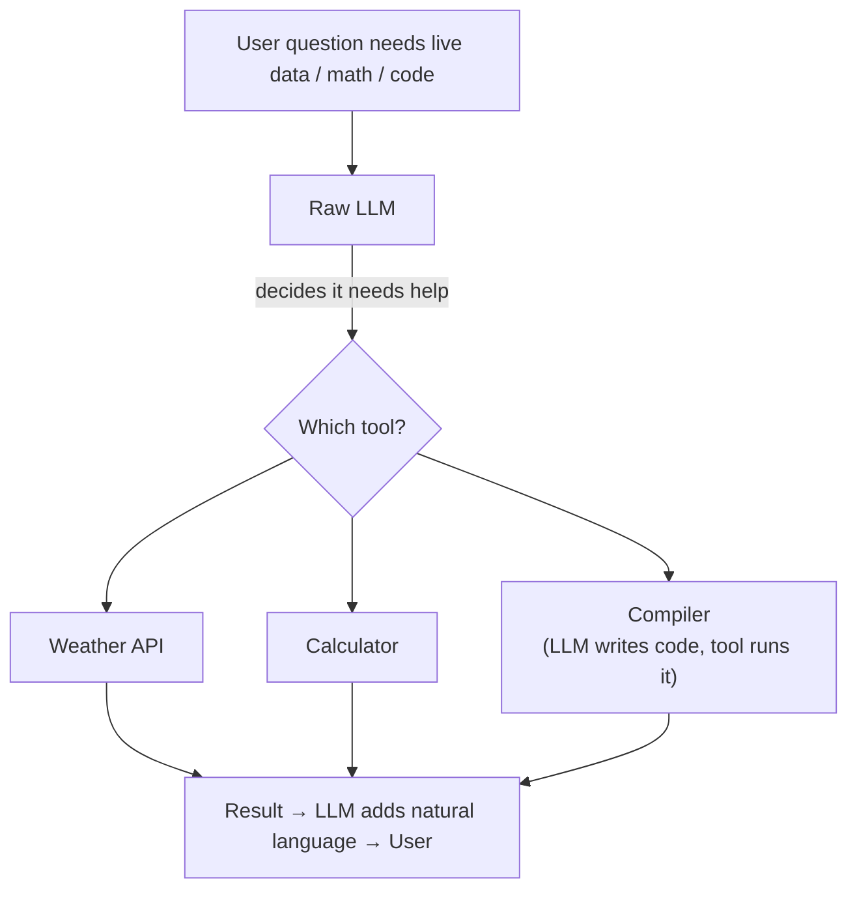
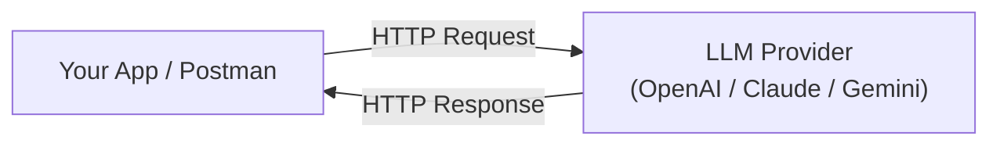
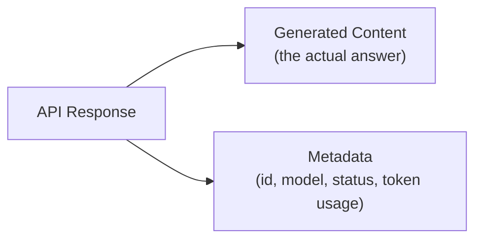
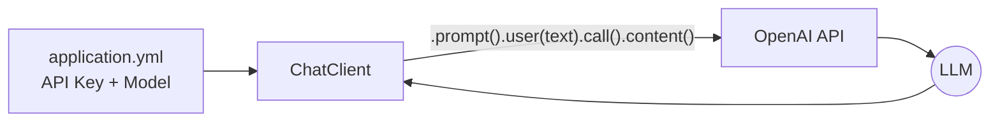

# Day 3 — Talking to an LLM from Your Application

---

## 1. ChatGPT ≠ an LLM

ChatGPT is a whole **application** built around a raw LLM — not the model itself.



> **An LLM is a capability. An application is the software built around that capability.**
> *(Analogy: LLM = engine. ChatGPT = the whole car — steering, brakes, dashboard, etc.)*

---

## 2. Raw LLMs Can't Do Things — Only Predict Text

A raw LLM **cannot**: browse the web, do reliable math, run code, or fetch live data. It only predicts the next token.

**Proof from the lecture:**
- Asked the *raw* model (via `platform.openai.com`, no tools) *"Weather in Delhi right now?"* → **fails**, says it has no live access.
- Asked it to multiply two random numbers → **wrong answer** (guessed).
- Asked it to count `*` characters in a string → **wrong count**.
- Asked ChatGPT (with tools) the same questions → **all correct**, because it used a weather API, a calculator/compiler, etc.



> Every model has a **knowledge cutoff date** (e.g. June 2024). Anything after that requires an external tool (search, API, etc.) — the model itself was never retrained live.

---

## 3. Talking to a Raw LLM Directly (No Tools)

Two ways to skip ChatGPT's tools/frontend entirely:
1. Use the provider's raw playground (e.g. `platform.openai.com/chat`)
2. Call their **API** directly — from Postman or your own code



No magic — it's a standard client-server API call, same as any REST API.

---

## 4. What Every LLM API Request Needs

| Component | Answers | Example |
|---|---|---|
| **Endpoint** | Where does the request go? | `https://api.openai.com/v1/responses` |
| **API Key** | Who is making the request? | `Authorization: Bearer <key>` |
| **Model** | Which model handles it? | `"model": "gpt-5.6-luna"` |
| **Input** | What should it process? | `"input": "Explain Docker in 2 lines"` |

```json
{
  "model": "gpt-5.6-luna",
  "input": "Explain Docker in two simple sentences."
}
```

> **API keys authenticate & meter usage** — every model call costs money based on **tokens** (input + output combined). Get a key from the provider's platform (e.g. OpenAI) or a free/cheap aggregator like **OpenRouter**. Never commit keys to GitHub.

---

## 5. Reading the Response

```json
{
  "output": [{ "content": [{ "text": "Docker packages an application..." }] }],
  "usage": { "input_tokens": 13, "output_tokens": 39, "total_tokens": 52 }
}
```



> **Cost = input tokens + output tokens.** A bigger prompt *and* a bigger reply both add up — this matters a lot once you start sending conversation history (covered in Day 4).

---

## 6. Doing It From Code (Spring AI Example)

Same 4 ingredients — just configured in your app instead of Postman.



**Config (`application.yml`):**
```yaml
spring:
  ai:
    openai:
      api-key: ${OPENAI_API_KEY}   # from env variable, never hardcoded
      chat:
        model: gpt-5.6-luna
```

**Service (business logic):**
```java
@Service
public class SummarizerService {
    private final ChatClient chatClient;

    public SummarizerService(ChatClient.Builder builder) {
        this.chatClient = builder.build();
    }

    public String summarize(String ticket) {
        return chatClient.prompt()
            .user("Summarize this support ticket in two lines:\n\n" + ticket)
            .call()
            .content();
    }
}
```

**Controller (API endpoint):**
```java
@RestController
@RequestMapping("/api")
public class SummarizerController {
    private final SummarizerService summarizerService;

    @PostMapping("/summarize")
    public String summarize(@RequestBody String ticket) {
        return summarizerService.summarize(ticket);
    }
}
```

Full flow: **Client → Controller → Service → ChatClient → OpenAI API → LLM → back up the chain.**

> Spring AI (or any SDK) is just a convenience wrapper — under the hood it's still the same HTTP request you built in Postman. It pays off later when you need memory, streaming, tool-calling, or multiple providers.

---

## 7. A Real Problem: Instructions Mixed with User Data

```java
.user("Summarize this support ticket in two lines:\n\n" + ticket)
```

This jams two *different* things into one message:

```
Application Instruction  ("summarize in 2 lines")
        +
Raw Customer Data        ("payment deducted but order stuck...")
```

Why is this a problem? A user could type anything — including things unrelated to the actual task (e.g., asking a food-delivery bot *"What is Docker?"* or *"What's 2+2?"*) — and the model may still respond, because it can't tell the app's instruction apart from user-supplied text.

> **This is exactly the problem "roles" (user / system) solve — covered next in Day 4.**

---

## Key Takeaways

1. **ChatGPT is an application, not just an LLM** — tools, guardrails, and memory live around the model, not inside it.
2. **A raw LLM can only predict text** — it needs external tools for math, live data, code execution, or search.
3. **Every LLM API call needs 4 things**: endpoint, API key, model, and input.
4. **Cost & usage are token-based** (input + output combined) — this is metered by your API key.
5. **Frameworks like Spring AI** are just abstractions over the same underlying HTTP API call.
6. **Mixing app instructions with raw user data in one message is risky** — sets up the need for distinct roles (Day 4).

---

## FDE Interview Questions

1. **Q:** Is ChatGPT the same thing as an LLM? Explain the distinction.
   **A:** No — ChatGPT is a full application (frontend + server + tools/guardrails) built *around* a raw LLM. The LLM is just the text-generation capability; the surrounding software decides what tools it can use, what data reaches it, and how output is filtered.

2. **Q:** Why can't a raw LLM reliably do arithmetic or fetch live weather data?
   **A:** An LLM only predicts the next most probable token based on training data — it has no built-in calculator, database, or internet access. Reliable computation or live data requires an external tool (calculator, compiler, API) that the LLM's surrounding application calls on its behalf.

3. **Q:** What four pieces of information does a basic LLM API request always need?
   **A:** An endpoint (where to send it), an API key (who's asking), a model name (which model handles it), and the input (what to process).

4. **Q:** How is the cost of an LLM API call calculated?
   **A:** Based on total tokens — input tokens (what you send) plus output tokens (what it generates) — both count toward billing and against the model's context window.

5. **Q:** Why might mixing your application's instructions with the end user's raw text in a single prompt be a bad practice?
   **A:** The model has no way to distinguish "trusted app instruction" from "untrusted user input" if they're sent as one plain message — a user could inject unrelated or malicious requests. This is solved by using distinct message roles (system vs. user), covered in the next lecture.

---

*Part of a personal FDE interview-prep repository, based on the Coder Army "Forward Deployed Engineer" series by Aditya Tandon.*