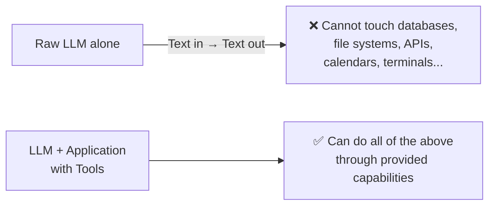
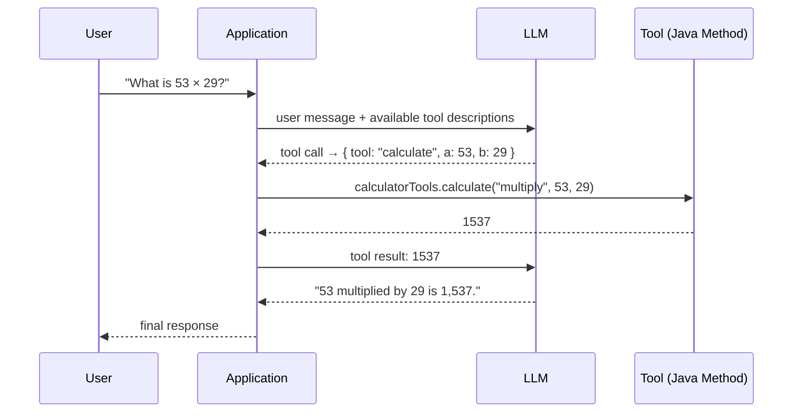
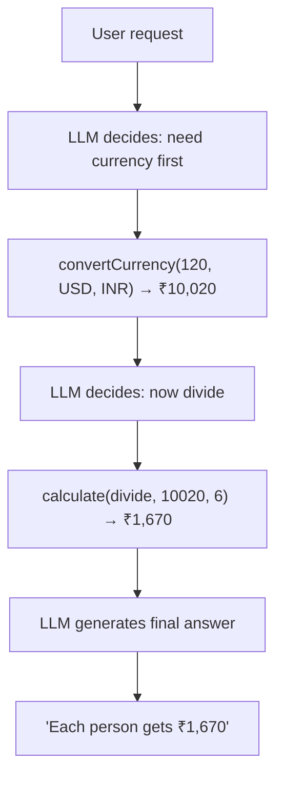
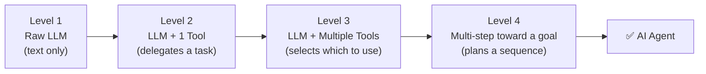
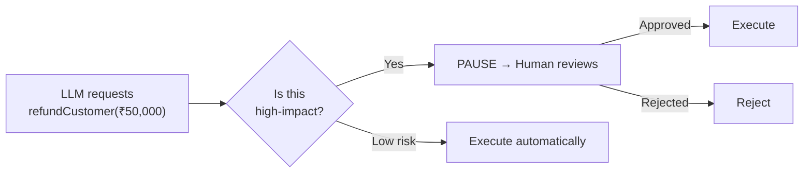
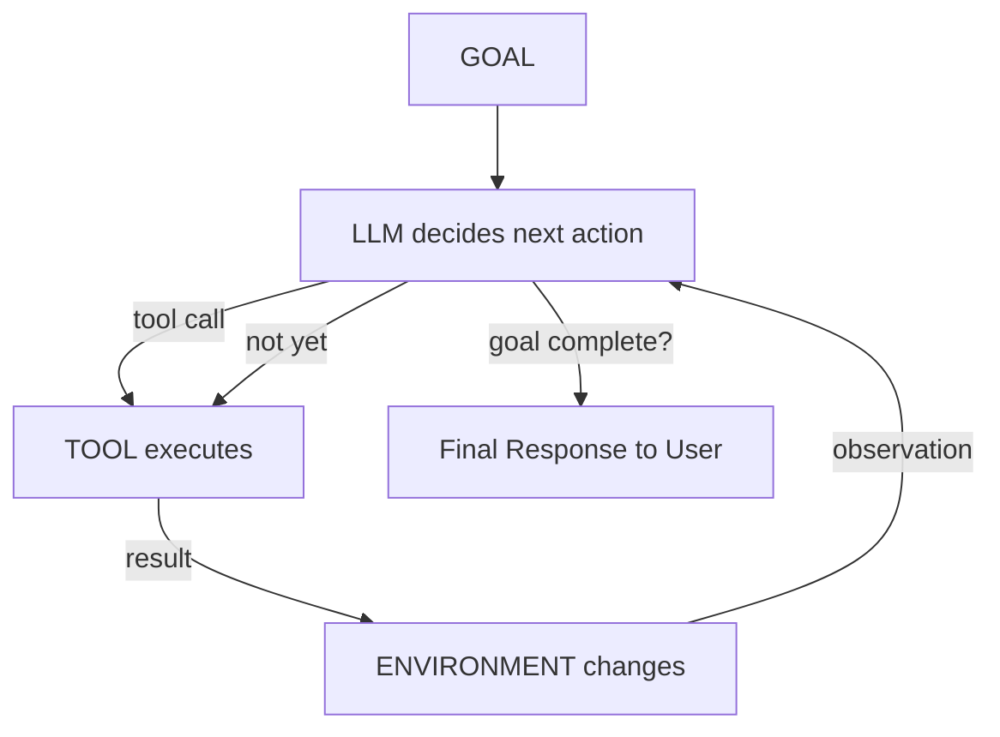

# Day 5 — AI Agents: Tools & Building an Agent

> **Series:** Forward Deployed Engineer (FDE) with Coder Army
> **Instructor:** Aditya Tandon

From raw LLM → Tool Calling → Multi-Tool Orchestration → Full AI Agent.

---

## 1. The Core Problem: LLMs Generate, They Don't Act

An LLM produces tokens — that's all it does. It cannot, by itself, touch a file system, call an API, or send an email.

```
Prompt: "Create a folder called portfolio"
LLM:    "mkdir portfolio"
```

The model generated *characters representing a command*. It did not run the command. This distinction is everything.

> **Mental model: LLM = Brain, Tools = Hands.** An intelligent person locked in a room with no hands can tell you *exactly* what to do — but cannot physically do it for you.



---

## 2. Why LLMs Need Tools: Two Reasons

**Reason 1 — Reliability:** LLMs *may* get arithmetic right, but a calculator is always right. For anything that needs to be deterministic, use a deterministic tool.

**Reason 2 — Live Data:** A model has a knowledge cutoff. It cannot know today's weather, current exchange rates, or your customer's order status. External tools fetch that.

The LLM's real superpower in this context is **translation**:


> **Key insight for FDEs:** One of the most valuable things an LLM does in real applications is not generating answers — it's **translating messy human intent into structured, machine-readable instructions** that your backend can act on.

---

## 3. What Is a Tool?

Strip away the AI jargon — **a tool is just a normal function** that the application makes available to the model.

```java
public double multiply(double a, double b) {
    return a * b;
}
```

Nothing AI-specific here. The key step is **describing the function to the model**:

```
Tool Name:    multiply
Description: Multiplies two numbers.
Parameters:  a: number, b: number
```

Now when a user asks *"What is 17 times 42?"*, the model doesn't try to compute it — it emits a **tool call**:

```json
{ "tool": "multiply", "arguments": { "a": 17, "b": 42 } }
```

The application executes the Java method and returns the result (`714`) back to the model, which then generates the final reply.

> A tool definition is like a REST API contract — the model is an intelligent client that chooses which endpoint to call.

---

## 4. The Tool-Calling Loop (Step by Step)



**Critical point:** The LLM never entered the JVM or ran any code. The *application* executed the Java method on the model's behalf. The model only issued a structured request.

---

## 5. Multiple Tools for One Goal

Tools can be chained — the model figures out the sequence itself.

**Example:** *"Convert $120 to INR and divide equally among 6 people."*



We didn't write `currencyTool(); calculatorTool();` — the model planned the sequence. **This is the beginning of agentic behaviour.**

---

## 6. Two Types of Tools

| Type | Purpose | Examples |
|---|---|---|
| **Information Tools** | Retrieve data the model doesn't have | Weather API, database lookup, search, currency rates |
| **Action Tools** | Change something in the external world | `sendEmail()`, `refundOrder()`, `createFile()`, `bookFlight()` |

> A weather tool lets the LLM *observe* the world. A file-writing tool lets it *change* the world. This distinction is critical for security and risk assessment.

---

## 7. When Does an LLM With Tools Become an Agent?

Think of it as a progression:



An agent is not defined by a single feature — it's the **combination** of:

| Component | What it means |
|---|---|
| **Goal** | Something needs to be achieved ("Build me a portfolio website") |
| **Decision Maker** | The LLM — constantly asking "What should I do next?" |
| **Actions** | The tools (createDirectory, writeFile, readFile...) |
| **Environment** | What the tools operate on (file system, database, web...) |
| **Observations** | The results returned after each action |
| **Loop** | After observing, decide again — repeat until goal is complete |

> **Formula:** `LLM + Tools + Environment + Observations + Decision Loop + Goal = AI Agent`

### Agent vs. Workflow

| Workflow | Agent |
|---|---|
| You define **WHAT + HOW** | You define **WHAT** |
| Steps are hardcoded | LLM decides the HOW |
| `Step 1 → createDir; Step 2 → createHTML...` | `"Build a website" → model plans its own steps` |

Real-world systems often combine both.

---

## 8. Practical Build: Website Builder Agent

The request is dead simple:
```json
{ "prompt": "Build a modern landing page for a coffee shop called BrewLab." }
```

The result is actual files on disk:
```
generated-sites/
└── brewlab/
    ├── index.html
    ├── style.css
    └── script.js
```

The agent uses four tools:

```java
createDirectory(path)   // creates a folder in the workspace
writeFile(path, content) // writes HTML/CSS/JS
readFile(path)          // reads back a file to verify or improve it
listFiles(path)         // surveys what's been created so far
```

The **read-back loop** is what makes this agentic:
```
ACT    → writeFile("index.html", ...)
OBSERVE → readFile("index.html")  → "needs a footer"
DECIDE → writeFile("index.html", improved version)
```

---

## 9. Security: Tool = Capability + Permission

⚠️ Giving the LLM access to a function is not just giving it a **capability** — it's giving it **permission** to affect your system.

**Bad — unrestricted shell access:**
```java
@Tool
public String runCommand(String command) { /* runs anything */ }
```
This lets the model access credentials, environment variables, application code, system commands...

**Good — sandboxed, scoped tools:**
```java
// Only operates inside a dedicated workspace directory
private final Path workspace = Path.of("generated-sites").toAbsolutePath();
```

**Prevent path traversal:**
```java
private Path safePath(String path) {
    Path resolved = workspace.resolve(path).normalize();
    if (!resolved.startsWith(workspace)) {
        throw new IllegalArgumentException("Path outside workspace not allowed");
    }
    return resolved;
}
```

So `../../secret.txt` → ❌ rejected. `brewlab/index.html` → ✅ allowed.

> **Key rule:** The LLM decides WHAT it wants to do. The **application** decides WHAT it is allowed to do. **The LLM must never be the security boundary.**

**Principle of least privilege:** Give the agent only the minimum capabilities it needs — no more.

---

## 10. Human-in-the-Loop

Not every tool should execute automatically. The higher the impact, the more oversight is needed.



Human-in-the-loop is especially important for: financial transactions, irreversible actions, external communications, and security-sensitive operations.

---

## 11. The Complete Mental Model



> **The shift in one sentence:** A chatbot primarily answers. An agent can decide, act, observe the result, and continue working toward a goal.

---

## Key Takeaways

1. An LLM generates tokens — it does not perform actions. Tools give it hands.
2. Tools are ordinary functions described to the model via a structured contract.
3. The LLM's hidden superpower: translating messy natural language into structured tool calls.
4. The application — not the LLM — actually executes tools and enforces security.
5. Tool results return to the model so it can decide what to do next (the loop).
6. Information tools read the world; action tools change it — treat them differently for security.
7. An agent = Goal + Decision Maker + Tools + Environment + Observations + Loop.
8. Agents decide *how* to use tools; workflows have *how* hardcoded.
9. **Tool = Capability + Permission** — expose only what the agent needs.
10. Sandbox agent environments; validate every path; add human-in-the-loop for high-impact actions.

---

## FDE Interview Questions

1. **Q:** What is the difference between an LLM generating a tool call and the application executing it?
   **A:** The LLM produces a structured JSON request indicating which function to call with which arguments. The application receives this, executes the actual code (Java method, API call, etc.), and returns the result. The LLM never directly runs code — the application acts as its hands.

2. **Q:** Why would you give an LLM a calculator tool when LLMs can already do math?
   **A:** LLMs can sometimes produce correct arithmetic but are fundamentally probabilistic — they predict tokens, not calculate numbers. For anything that must be reliably correct (billing, quantities, financial calculations), a deterministic calculator is far more trustworthy. Use the LLM for intent extraction, use the tool for computation.

3. **Q:** What is the difference between an AI workflow and an AI agent?
   **A:** A workflow has both WHAT and HOW hardcoded — steps are predefined. An agent receives a goal (WHAT) and decides HOW to achieve it using available tools, dynamically planning the sequence. Real-world systems often combine both.

4. **Q:** A customer calls you concerned that their LLM agent could access sensitive files. How do you address this?
   **A:** Sandbox the agent's environment — restrict all file operations to a dedicated directory. Validate every path server-side (check it resolves within the workspace before executing). Apply the principle of least privilege — expose only the specific tools the agent needs, not a general shell command. The LLM should never be the security boundary; the application enforces permissions.

5. **Q:** When would you add human-in-the-loop to an agentic system?
   **A:** Whenever a tool can perform consequential, irreversible, or high-value actions — financial transactions, sending external communications, deleting data, making security-sensitive changes. The pattern is: LLM requests action → system pauses → human approves or rejects → system executes or discards.

---

*Part of a personal FDE interview-prep repository, based on the Coder Army "Forward Deployed Engineer" series by Aditya Tandon.*