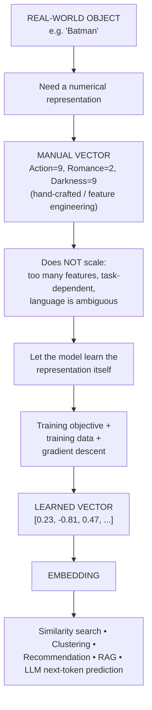

# Day 7 — Vector Embeddings: From First Principles

> **Course:** Forward Deployed Engineering (FDE)
> **Topic:** Why computers need numbers to "understand" anything, how vectors are built by hand, why hand-crafted features break down, and how embedding models learn meaning from context.

---

## 1. What Can a Computer Actually Understand?

Give a human the word **Batman**, and a flood of associations shows up instantly: superhero, Gotham, Bruce Wayne, DC, dark, vigilante, rich, action.

A computer has none of that. At the lowest level, a computer only understands numbers (ultimately, binary). It can store the characters `B-a-t-m-a-n`, or a token like `23`, but:

> **Storing a symbol is not the same as understanding its meaning.**

Tokenization (turning a word into a token ID) does **not** give that token any inherent meaning. Token `23` for "Batman" is just as meaningless to a model as any other number — meaning has to come from somewhere else.

---

## 2. Identity vs Meaning

Traditional computing is extremely good at **exact matching**:

```text
"Batman" == "Batman"   → true
"Batman" == "Superman" → false
```

But exact-match string comparison breaks down instantly on meaning:

```text
"I forgot my password."
"How can I recover my login credentials?"
```

As strings, these are completely different. As **meaning**, they are nearly identical. Character-by-character matching has no concept of semantics — the moment one character diverges, the comparison gives up.

> **The central problem: how do we convert meaning into something mathematics can operate on?**

---

## 3. Why We Need Numbers

Machine learning, neural networks, and mathematical algorithms only operate on numbers. There isn't much useful math you can do directly on `Batman`, `Superman`, `Interstellar`, `Pizza` — but once something *is* a number, you unlock:

- addition, multiplication
- distance
- angles
- probabilities
- matrix operations

**First requirement:** turn real-world things (words, sentences, documents, movies, users, songs, images, proteins...) into numerical representations. Random numbers don't work — they carry no relationship between objects.

---

## 4. First Attempt: Represent Something With One Number

Imagine building a 1990s-era Netflix movie recommendation engine from scratch — no LLMs, no existing tech. Start simple: score every movie on a single trait, **Action** (out of 10).

| Movie | Action Score |
|---|---|
| Avengers | 10 |
| Batman | 9 |
| Interstellar | 6 |
| Titanic | 2 |
| Hera Pheri | 1 |

Now similarity is measurable:

```text
|Batman - Avengers| = |9 - 10| = 1   → close
|Batman - Hera Pheri| = |9 - 1| = 8  → far
```

This is a **one-dimensional space**. Every movie has a position on a single number line, and distance becomes meaningful.

**The limitation:** Titanic (2) and Hera Pheri (2/1) end up with near-identical scores on the Action axis — yet one is a romantic drama and the other is a comedy. **One number can only capture one property**, and real objects have many properties.

---

## 5. From One Number to Multiple Numbers → Vectors

Add a second parameter, **Comedy**:

| Movie | Action | Comedy |
|---|---|---|
| Batman | 9 | 1 |
| Avengers | 10 | 7 |
| Titanic | 2 | 1 |
| Hera Pheri | 2 | 10 |
| Interstellar | 6 | 1 |

`Batman` is no longer `9` — it becomes `[9, 1]`. This ordered collection of numbers is a **vector**.

Plotting these on an (Action, Comedy) plane instantly fixes the earlier problem: Titanic and Hera Pheri, which looked identical in 1D, are now far apart because their Comedy scores diverge sharply.

```text
similarity(Titanic, Hera Pheri) in 1D  → looked high (wrong)
similarity(Titanic, Hera Pheri) in 2D  → correctly far apart
```

**Order matters.** `[9, 2]` (high action, low comedy) is a completely different movie profile than `[2, 9]` (low action, high comedy) — the position in the vector defines which dimension a value belongs to.

---

## 6. Vectors, Dimensions & Vector Space

| Term | Meaning |
|---|---|
| **Vector** | An ordered collection of numbers representing something, e.g. `Batman = [9, 1]` |
| **Dimension** | Each value/position in the vector, e.g. position 1 = Action, position 2 = Comedy |
| **Vector Space** | The n-dimensional space in which all vectors are plotted and compared |

You can keep adding dimensions — Romance, Darkness, Violence, Mystery — and the more dimensions you add, the more of a movie's "crux" you capture.

```text
Batman = [
    9,  // action
    1,  // comedy
    2,  // romance
    9,  // darkness
    8,  // violence
    7   // mystery
]
```

Humans can only *visualize* up to 3 dimensions, but the math (distance, similarity) works identically at any dimensionality — 6, 100, or 100,000. Modern LLMs work with **thousands** of dimensions per token/word/sentence.

> **High-dimensional spaces are difficult for humans to visualize, not difficult for computers to calculate with.**

---

## 7. Measuring Similarity Between Vectors

Three standard metrics — pick based on what your application actually needs to measure.

### 7.1 Euclidean Distance
The plain straight-line distance formula:

```text
distance = √[(x2 - x1)² + (y2 - y1)²]
```

- Smaller distance → more similar
- Works well when raw magnitude matters (e.g., "how close are these two movies on these exact scores?")
- **Fails** when two vectors represent the *same ratio/pattern* but at different scales — e.g. `User A = [1, 10]` and `User B = [10, 100]` have identical ratios (both strongly prefer comedy over action, 1:10) but Euclidean distance would place them far apart.

### 7.2 Cosine Similarity
Focuses purely on the **angle/direction** between two vectors, ignoring magnitude.

```text
cosine_similarity(A, B) = (A · B) / (|A| × |B|)
```

| Value | Meaning |
|---|---|
| `1` | Same direction (highly similar) |
| `0` | Unrelated / perpendicular |
| `-1` | Opposite direction |

This is exactly what fixes the User A / User B problem above — both vectors point in the same direction, so cosine similarity correctly scores them as highly similar even though their raw magnitudes differ hugely.

### 7.3 Dot Product
Combines **both** direction and magnitude:

```text
A · B = |A| × |B| × cos(θ)
```

Useful when both "are they aligned?" and "how strong/large are they?" matter together.

### Choosing a metric

| Metric | Main Idea | Ask Yourself |
|---|---|---|
| Euclidean Distance | Straight-line distance | How physically close are the vectors? |
| Cosine Similarity | Angle between vectors | Same pattern, regardless of size? |
| Dot Product | Direction + magnitude | Are they aligned, and how strong? |

> There's no universally "best" metric — it depends entirely on what your application is trying to measure.

---

## 8. The Big Problem: Who Decides the Dimensions?

So far, every dimension (Action, Comedy, Romance...) was **hand-crafted by a human**. This is called **feature engineering**, and it has three serious problems:

### Problem 1 — How many features should we create?
For a single movie like *Interstellar*, you could reasonably add: space, science, family, fatherhood, time, love, survival, philosophy, physics, sadness, adventure, hope, sacrifice, isolation... There's no natural stopping point, and different people would choose different features entirely.

### Problem 2 — Features depend on the task
The same movie needs *completely different* features depending on the goal:

| Task | Useful Features |
|---|---|
| Movie recommendation | genre, tone, pace |
| Box-office prediction | budget, actor popularity, release date, marketing spend |
| Parental controls | violence, language, sexual content |

Same object, different representations — there is no single universally-correct feature list.

### Problem 3 — Natural language is deeply ambiguous
- **King** needs features like royalty, authority, wealth, power.
- **Apple** needs fruit, food, company, technology, sweet, red.
- **Java** could mean programming language, island, or coffee.
- **Bank** means something entirely different in *"I deposited money at the bank"* vs *"The fisherman sat on the river bank"* — same word, opposite meaning, driven entirely by **context**.

Manually engineering features for every word, in every context, across an entire language, is effectively impossible.

---

## 9. The Scalable Solution: Let the Model Learn Embeddings

Instead of asking:

> "Which dimensions should we manually create?"

we ask:

> **"What task should the model learn to solve?"**

If the model is trained to become good at that task, useful internal representations (vectors) emerge **as a side effect** — without any human deciding what each dimension means.

### How training actually works (toy example)

Vocabulary: `king`, `queen`, `banana`, `apple`. Give each word a random 2D vector to start:

```text
king   = [0.2, -0.7]
queen  = [-0.8, 0.3]
banana = [0.9, 0.1]
apple  = [-0.1, -0.5]
```

These numbers mean **nothing** yet — `king` could accidentally be closer to `banana` than to `queen`. That's fine; training hasn't happened.

**Objective:** given a word, predict a related/nearby word.

```text
Input: king → Model predicts: banana   (wrong — high loss)
Correct answer: queen
→ model adjusts its parameters slightly
```

Repeat this process across millions/billions of iterations, over huge amounts of text. Because sentences like *"The king ruled the kingdom"* and *"The queen ruled the kingdom"* keep placing `king` and `queen` in the same surrounding context, the model gradually learns to pull their vectors closer together — and pushes `king` and `banana` apart, since they never share context.

> **"You shall know a word by the company it keeps."** — words appearing in similar contexts end up with similar learned representations.

This is exactly how a child (or a model) can guess *"The queen wears a ___"* → **crown**, purely from having seen *"The king wears a crown"* and knowing king/queen behave similarly — even without knowing the dictionary definition of "crown."

---

## 10. Latent Space & Why the Dimensions Are "Hidden"

In a hand-crafted vector, every dimension has an obvious meaning:

```text
[royalty, gender, authority]
```

In a **learned** embedding, that's no longer true:

```text
king  = [0.31, -0.84, 0.17, 0.66, ...]
queen = [0.29, -0.78, 0.21, 0.61, ...]
```

It would be wrong to assume "dimension 1 = royalty." Meaning in a learned embedding is usually **distributed across many dimensions simultaneously**, not localized to one clean human-readable coordinate — much like how a city's coordinates `[28.61, 77.20]` don't individually mean "Delhi-ness," but together place Delhi at a meaningful location relative to every other city.

This is why we call these:

- **Latent space** / **latent representation** / **latent dimensions**
- *Latent* = hidden, not directly observed, not manually specified

Nobody hand-designed what dimension 4 or dimension 207 "means" — it emerged from training and is often entangled with many other concepts.

---

## 11. Vector vs. Embedding — The Key Distinction

> **Every embedding is represented using a vector, but not every vector is an embedding.**

| | Vector | Embedding |
|---|---|---|
| Definition | An ordered collection of numbers (the mathematical container) | A **learned** representation that places an object inside a continuous vector space |
| Example | `[height, weight, age]` — a hand-designed "feature vector" | `[0.23, -0.81, 0.47, ...]` — learned by a model via training |
| Who decides the values | A human, explicitly | The model, via gradient descent on a training objective |

An **embedding model** is simply a function:

```text
Input (word / sentence / image / anything)
        ↓
   Embedding Model
        ↓
   d-dimensional vector

f("Batman is a dark superhero movie") → [0.12, -0.37, 0.91, ..., 0.22]   (e.g. R^768 or R^1536)
```

The output dimensionality (768, 1536, etc.) is a design choice baked into that specific embedding model.

---

## 12. Almost Anything Can Be Embedded

Embeddings aren't limited to single words — the exact same idea extends to any object:

```text
Word      → Vector
Sentence  → Vector
Document  → Vector
Movie     → Vector
User      → Vector
Song      → Vector
Image     → Vector
Product   → Vector
```

The recurring question is always the same:

> **Can we learn a useful mathematical space in which relationships between these objects become accessible through geometry?**

Once objects are vectors, you can run:

- Similarity search / nearest-neighbor search
- Clustering
- Classification
- Ranking
- Recommendation
- Retrieval (this is the foundation of RAG — Retrieval-Augmented Generation)

This is also *exactly* how modern LLMs decide the next token: they don't hardcode rules — they compare the embedding of the current context against the embeddings of every candidate token in the vocabulary and pick the one with the highest similarity/probability.

---

## 13. The Complete Journey (Diagram)



---

## Key Takeaways

1. **Storing a symbol ≠ understanding meaning.** A token ID has no inherent meaning to a model.
2. **Exact string matching only tells you "same or different"** — it cannot express *how* similar two things are.
3. **One number captures one property.** Real-world objects need multiple dimensions to be represented meaningfully.
4. **A vector is an ordered collection of numbers; order/position defines what each number means (its dimension).**
5. **Similarity has three common lenses** — Euclidean distance (raw closeness), Cosine similarity (same pattern/direction), Dot product (direction + magnitude) — and the right one depends on the application.
6. **Hand-crafted features (feature engineering) don't scale** — because of unbounded feature counts, task-dependence, and the sheer ambiguity of natural language.
7. **Embeddings are *learned*, not designed.** A model starts with random vectors and adjusts them via a training objective until useful structure emerges.
8. **"You shall know a word by the company it keeps"** — context, not dictionary definitions, is what drives learned similarity.
9. **Latent dimensions are hidden and distributed** — you generally cannot map a single learned dimension to a single human concept like "royalty."
10. **Every embedding is a vector, but not every vector is an embedding** — the difference is whether the values were hand-designed or learned.
11. **Embeddings generalize far beyond words** — sentences, documents, images, users, and products can all be embedded into the same kind of space, enabling similarity search, recommendation, and retrieval (RAG).

---

## FDE Interview Questions

Cover the answers and try these yourself first.

1. **Why can't a computer "understand" the word Batman just by storing its characters or token ID?**
2. **What's the practical difference between `"Batman".equals("Batman")` and asking "how similar are these two sentences in meaning?"** Why does exact-match fail on the password/credentials example?
3. **Walk through why a single "Action score" is not enough to build a good movie recommendation engine. What breaks, specifically?**
4. **Define: vector, dimension, vector space, embedding — and explain the relationship between the first three and the last one.**
5. **You have `User A = [9, 1]` and `User B = [90, 10]` representing (action preference, romance preference). Euclidean distance says they're far apart, but they're actually very similar. Why? Which metric fixes this, and why?**
6. **What is feature engineering, and what are its three biggest failure modes at scale?**
7. **Explain, step by step, how a model can learn that `king` and `queen` are similar without a human ever telling it so.**
8. **What does "latent" mean in "latent space"? Why is it usually wrong to say "dimension 3 of this embedding means royalty"?**
9. **A colleague says "vectors and embeddings are the same thing." Correct them precisely.**
10. **How do embeddings connect to Retrieval-Augmented Generation (RAG) and to how an LLM predicts its next token?**
11. **Given an embedding model that outputs `R^768`, what does that actually mean, and why might a different embedding model output `R^1536` instead?**
12. **A teammate wants to build a search feature and picks Euclidean distance by default without discussion. What follow-up questions would you ask before agreeing that's the right metric?**

---

*Notes built from the Coder Army "Forward Deployed Engineer" YouTube series by Aditya Tandon — Day 7: Vector Embeddings, From First Principles.*